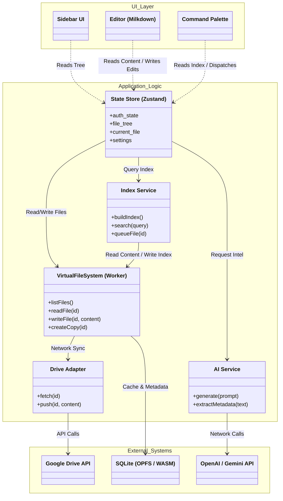

# Software Architecture

This document outlines the modular architecture for the Personal Assistant application, designed to support parallel development and testability.

## 1. Modular Breakdown

The application is divided into distinct services/modules to separate concerns:

*   **UI Layer**: React Components (Sidebar, Editor, Command Palette). Strict separation from business logic.
*   **State Store**: Global state management (Files, Auth User, Settings).
*   **VirtualFileSystem (VFS)**: Unified repository for file operations. Orchestrates Caching (IndexedDB) and Network (DriveAdapter).
*   **DriveAdapter**: Internal adapter for Google Drive API interactions (Read/Write/List).
*   **EditorModule**: Wrapper around Milkdown/ProseMirror. Handles Markdown parsing and rendering.
*   **IndexService**: Manages the Keyword/Entity Index. Interactions with VFS for file access.
*   **AIService**: Interface for external AI APIs (OpenAI/Gemini).

## 2. Component Architecture (High-Level Data Flow)

This diagram visualizes the dependencies between modules. The **VirtualFileSystem** acts as the single data gatekeeper, abstracting away the complexity of caching and network synchronization.

### Module Responsibilities

| Module | Responsible For | Communicates With |
| :--- | :--- | :--- |
| **Store** | Single Source of Truth. Dispatches actions. | VFS, IndexService, AIService |
| **VFS** | **Repository Pattern**. Manages Caching (**SQLite**) & Syncing (Drive). Runs in **WebWorker**. | DriveAdapter, SQLite |
| **DriveAdapter** | Minimal GAPI wrapper. | GAPI (External) |
| **IndexService** | Maintaining **FTS5 Index** Tables. | VFS, AIService |
| **AIService** | Abstraction for LLM calls (Metadata Extraction). | External APIs |

## 3. Parallel Development Strategy

*   **Developer A (Core/VFS)**: Implement `VirtualFileSystem` (Worker), `DriveAdapter`, and `SQLite` (wa-sqlite) setup.
*   **Developer B (Editor)**: Implement `EditorModule` (Milkdown) and `Autosave` logic.
*   **Developer C (UI/State)**: Build `Sidebar`, `CommandPalette`, and connect to `State Store`.
*   **Developer D (AI/Index)**: Implement `IndexService` logic and `AIService` integration.

## 4. Concurrency & Workers

*   **Worker Isolation**: Run `VirtualFileSystem` and `IndexService` inside a dedicated WebWorker to keep Drive and SQLite work off the main thread.
*   **SQLite Access**: Maintain a single SQLite connection in the worker (wa-sqlite + OPFS), with a serialized job queue for writes to avoid locking issues.
*   **Async API**: Expose async, message-based methods (`list/read/write/index`) from worker to UI; UI must not perform blocking storage operations on the main thread.

## 5. Indexing Strategy

To fulfill the "Whole Drive" indexing requirement scalably on the client-side, the system uses a **Keyword & Entity Extraction** approach stored in **SQLite FTS5**.

### 4.1. Index Structure
The index is a set of **Relational Tables** in the SQLite DB.
1.  **Files Table**: `id (PK), path, last_modified, checksum`
2.  **FTS Index**: Virtual Table containing `summary, keywords, entities` supporting fast `MATCH` queries.
3.  **Tags/Metadata**: Structured tables for future expansion.

### 4.2. Build Process (The "Background Crawler")
The `IndexService` runs a non-blocking background loop:
1.  **Crawler**: Calls `VFS.listFiles()` (pages of 1000). Compares `LastModified` against `Files Table`.
2.  **Queue**: Pushes changed/new FileIDs into a `queue` table in SQLite.
3.  **Worker**:
    *   Pops batch of files from `queue`.
    *   Calls `VFS.readFile(id)` to fetch text content.
    *   **Calls AIService**: Sends text to LLM (e.g. `gpt-4o-mini`) with prompt: *"Extract 5 keywords, names, and 1-sentence summary."*
    *   Updates `FTS Index` via SQL `INSERT`.
4.  **Sync**: Periodically calls `VFS.exportDB()` to save a snapshot to `/.app_state/index.db`.

### 4.3. Search Process
When the user queries via Command Palette:
1.  **Local Search**: Runs SQL query: `SELECT module FROM fts_index WHERE fts_index MATCH ?`.
2.  **Ranking**: SQLite FTS5 `rank` function.
3.  **Result**: Returns instant results.

