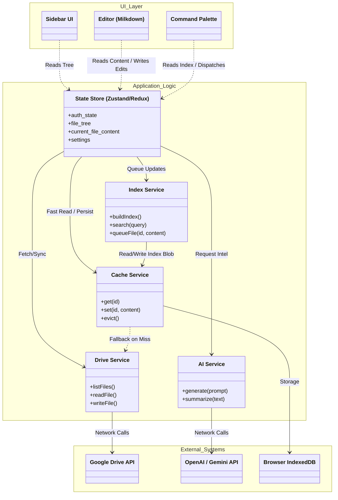

# Software Architecture

This document outlines the modular architecture for the Personal Assistant application, designed to support parallel development and testability.

## 1. Modular Breakdown

The application is divided into distinct services/modules to separate concerns:

*   **UI Layer**: React Components (Sidebar, Editor, Command Palette). Strict separation from business logic.
*   **State Store**: Global state management (Files, Auth User, Settings).
*   **DriveService**: Handles all Google Drive API interactions (Read/Write/List).
*   **CacheService**: Manages `IndexedDB` persistence and LRU eviction. Intercepts calls from DriveService where appropriate.
*   **EditorModule**: Wrapper around Milkdown/ProseMirror. Handles Markdown parsing and rendering.
*   **IndexService**: Manages the Search Index (`tf-idf` or vector). Handles background updates.
*   **AIService**: Interface for external AI APIs (OpenAI/Gemini).

## 2. Component Architecture (High-Level Data Flow)

This diagram visualizes the dependencies between modules. Each arrow represents a data flow or function call. The clear separation allows **DriveService** or **AIService** to be mocked entirely/swapped out without affecting the UI.

### Module Responsibilities

| Module | Responsible For | Communicates With |
| :--- | :--- | :--- |
| **Store** | Single Source of Truth. Dispatches actions. | All Services & UI |
| **DriveService** | GAPI abstractions. Handling Auth & API quotas. | GAPI (External) |
| **CacheService** | Performance & Persistence. Hiding IndexedDB complexity. | DriveService (Fallback) |
| **IndexService** | Maintaining search index (Vector/TF-IDF) & syncing to App Root. | CacheService, DriveService |
| **AIService** | Abstraction for LLM calls (Stateless). | External APIs |

## 3. Parallel Development Strategy

*   **Developer A (Core/Drive)**: Implement `DriveService` and `CacheService`. Mock GAPI for tests.
*   **Developer B (Editor)**: Implement `EditorModule` (Milkdown) and `Autosave` logic.
*   **Developer C (UI/State)**: Build `Sidebar`, `CommandPalette`, and connect to `State Store`.
*   **Developer D (AI/Index)**: Implement `IndexService` logic and `AIService` integration.
